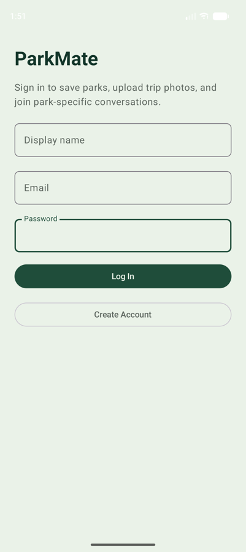
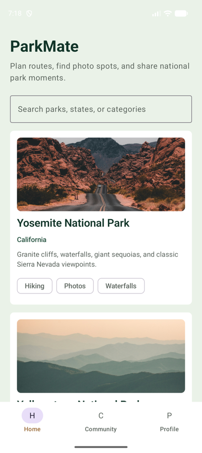
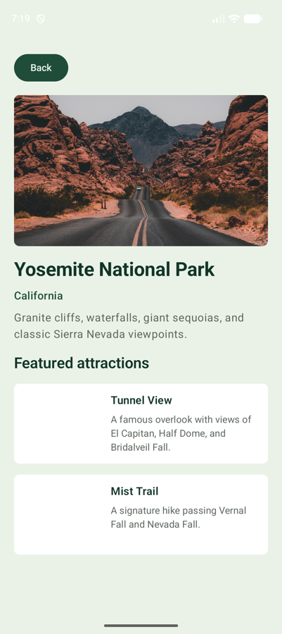
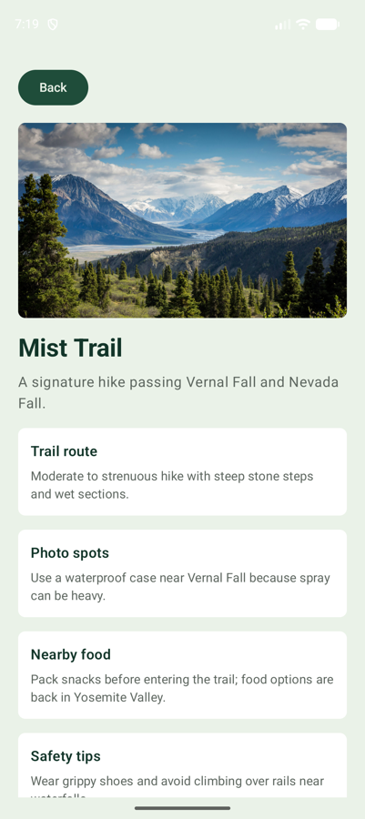

# ParkMate

**Version:** 0.3.0

ParkMate is a native Android travel companion app for National Park visitors. It combines a focused park guide with a photo-sharing community so users can plan a visit, browse attractions, upload photos, and exchange tips with other travelers.

## High-Level Design

### Goal

ParkMate helps users move through the National Park travel journey:

```text
Plan trip -> Browse park -> View attractions -> Take/upload photo -> Share with community
```

The app is not a full map app and not a general social media app. The product stays focused on National Park planning, attraction discovery, photo sharing, and visitor tips.

### Tech Stack

```text
Platform: Android
IDE: Android Studio
Language: Kotlin
UI: Jetpack Compose
Architecture: MVVM + Repository Pattern
Backend: Firebase
Database: Cloud Firestore
Authentication: Firebase Authentication
File Storage: Firebase Storage
Device Features: Camera, Photo Picker, Location
```

### Firebase Setup

Firebase dependencies are already included. The app uses Firebase Authentication for login/sign-up and Firestore for creating a user profile after registration.

To connect a real Firebase project:

1. Create a Firebase project in the Firebase Console.
2. Add an Android app with package name `com.example.parkmate`.
3. Download `google-services.json`.
4. Place it at `app/google-services.json`.
5. Enable Email/Password sign-in in Firebase Authentication.
6. Create a Firestore database.

The Gradle build automatically applies the Google Services plugin when `app/google-services.json` is present. The file is gitignored so local Firebase credentials are not committed.

### System Architecture

```text
ParkMate Android App
|
|-- UI Layer
|   |-- LoginScreen
|   |-- HomeScreen
|   |-- ParkDetailScreen
|   |-- AttractionDetailScreen
|   |-- UploadScreen
|   |-- CommunityScreen
|   `-- ProfileScreen
|
|-- ViewModel Layer
|   |-- AuthViewModel
|   |-- ParkViewModel
|   |-- PostViewModel
|   `-- ProfileViewModel
|
|-- Repository Layer
|   |-- AuthRepository
|   |-- ParkRepository
|   |-- PostRepository
|   `-- StorageRepository
|
`-- Data Sources
    |-- Firebase Authentication
    |-- Cloud Firestore
    |-- Firebase Storage
    |-- Local Park Seed Data
    `-- Android Device APIs
```

### Core Screen Flow

```text
Launch App
   |
   v
Login / Sign Up
   |
   v
Home / Park List
   |
   v
Park Detail
   |
   v
Attraction Detail
   |
   +----> Upload Photo
   |          |
   |          v
   |      Community Feed
   |
   +----> Back to Park Detail

Bottom Navigation:
Home | Community | Profile
```

## Current UI

The current version is the first working UI skeleton. It focuses on getting the app structure, navigation, screen layouts, and dummy data in place before Firebase logic is connected.

<p>
  
  
  
  
</p>

The app currently includes the planned proposal screens:

- Login / Sign Up
- Home / Park List
- Park Detail
- Attraction Detail
- Camera / Upload
- Community
- Profile

The UI code is organized under `app/src/main/java/com/example/parkmate/ui`:

- `ParkMateApp.kt` contains the app scaffold, navigation graph, and bottom navigation.
- `navigation/Destination.kt` contains the route names used by the app navigation.
- `screens/` contains the screen-level composables.
- `components/` contains reusable UI pieces such as shared section cards and empty states.
- `preview/` contains dummy data used by Android Studio previews.

Each screen has a Compose `@Preview` so the layouts can be checked quickly in Android Studio without running the full app.

### Data Strategy

Park and attraction content is static for the final demo, so it starts as local seed data. User-generated data is dynamic and belongs in Firebase.

Static local data:

- Parks
- Attractions
- Trail notes
- Photo tips
- Nearby food
- Safety tips

Firebase dynamic data:

- Users
- Posts
- Comments
- Likes
- Saved parks

### Firestore Schema

```text
users/{userId}
  displayName: string
  email: string
  photoUrl: string?
  createdAt: timestamp

posts/{postId}
  userId: string
  userName: string
  parkId: string
  attractionId: string?
  imageUrl: string
  caption: string
  likeCount: number
  commentCount: number
  createdAt: timestamp

posts/{postId}/comments/{commentId}
  userId: string
  userName: string
  text: string
  createdAt: timestamp

posts/{postId}/likes/{userId}
  userId: string
  createdAt: timestamp

users/{userId}/savedParks/{parkId}
  parkId: string
  savedAt: timestamp
```

### Firebase Storage Paths

```text
post_images/{userId}/{postId}.jpg
profile_images/{userId}.jpg
```

### MVP Scope

Required for the final demo:

1. User registration, login, and logout.
2. Home screen with a National Park list.
3. Park detail screen with attraction list.
4. Attraction detail screen with trail info, photo tips, food, and safety tips.
5. Photo picker or camera upload.
6. Firebase Storage upload and Firestore post creation.
7. Community feed from Firestore posts.
8. Basic like and comment interaction.
9. Profile screen with user info and posted photos.

Stretch goals:

- GPS nearby parks.
- Compass.
- Map view.
- Advanced itinerary planning.
- Friend/follow system.
- Push notifications.

### Suggested Implementation Order

1. Android project setup and Firebase dependencies.
2. Navigation and empty screens.
3. Local park seed data.
4. Home, park detail, and attraction detail.
5. Firebase Auth.
6. Photo upload.
7. Community feed.
8. Like and comment.
9. Profile.
10. UI polish and final testing.

## Current Implementation Status

Done:

- Android Studio Kotlin project scaffold.
- Jetpack Compose app shell.
- Login/sign up, home, park detail, attraction detail, upload placeholder, community placeholder, and profile placeholder screens.
- Screen previews with dummy data for the intended screens.
- Common reusable UI components under `ui/components`.
- Local seed data for Yosemite, Yellowstone, and Grand Canyon.
- `ParkRepository` and `ParkViewModel` unit tests.
- Firebase dependencies added to Gradle.
- Firebase Auth repository and AuthViewModel added.
- Login and sign-up UI connected to authentication state.
- Profile screen reads the authenticated user and supports logout.

Next required tasks:

1. Create the Firebase project and add `app/google-services.json`.
2. Test registration/login against the real Firebase project.
3. Replace upload placeholder with Android Photo Picker and Firebase Storage upload.
4. Replace community placeholder posts with Firestore posts.
5. Add like and comment repository methods.

## Firebase Setup Note

The app uses `DisabledAuthRepository` when `google-services.json` is missing. This keeps the skeleton runnable before Firebase credentials are added and shows a clear setup error on the login screen instead of crashing.
